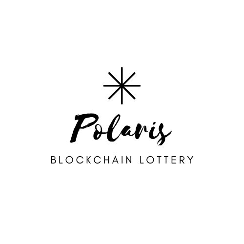
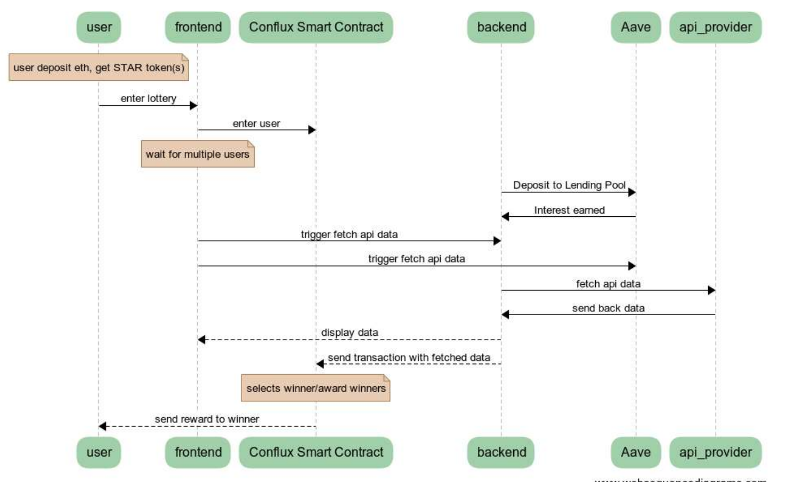
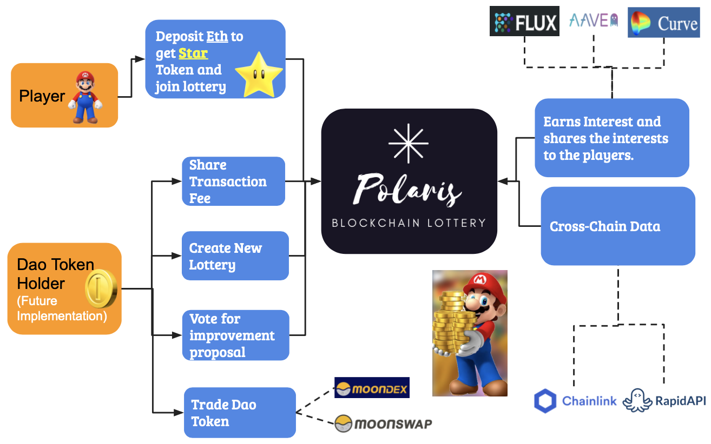
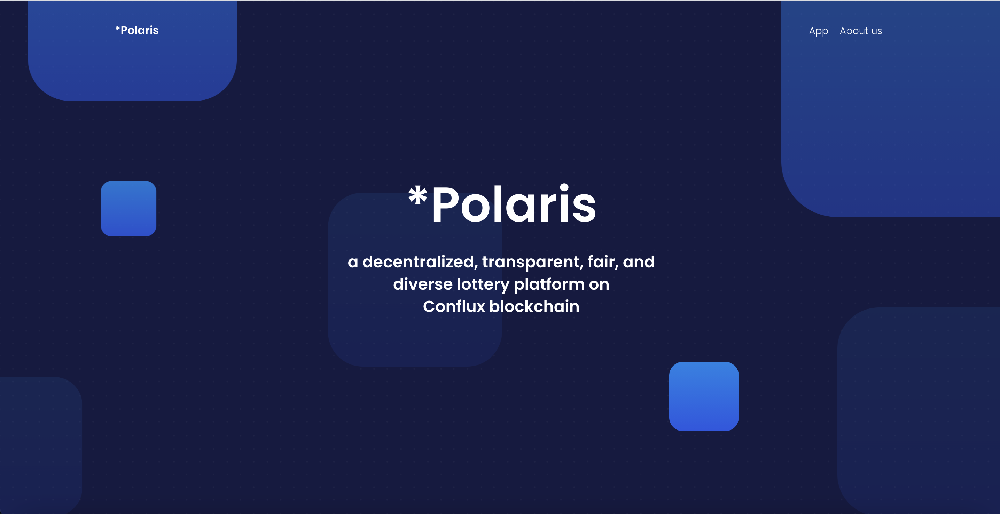
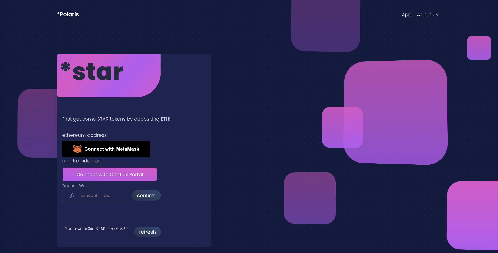
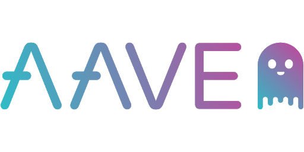

# Polaris Lottery

Polaris is a decentralized, transparent, fair, diverse lottery platform built on Conflux Network using cross-chain technologies to reduce users' expenses with low transaction fees. It ultilizes yield farming protocols, such as Aave,to generate interest which is distributed as prizes for no participant losses. It offers sports and financial lottery by using off-chain solutions and connecting to external APIs. A factory design pattern is also used to allow users to create their own interactive lottery games that enable user interactions. Polaris empowers a one-of-a-kind blockchain lottery experience.

# Structure of GitHub

EthContract - Ethereum Smart Contract Deployed on Kovan, Aave implementation 

Polaris_Lottery - STAR Token, Lottery Contract on Conflux Netowork, deployed on testnet 

polaris-frontend - frontend of Polaris, uses React, Web3.js and Conflux javascript lib

ExpressServer - backend of Polaris, retrieves API data and interacts with Conflux smart contracts

imgs - image folder for project

resource - resources and documentations for project

# Version 2.0 Architecture

# User Story

# App Illustration

# Technologies
 

