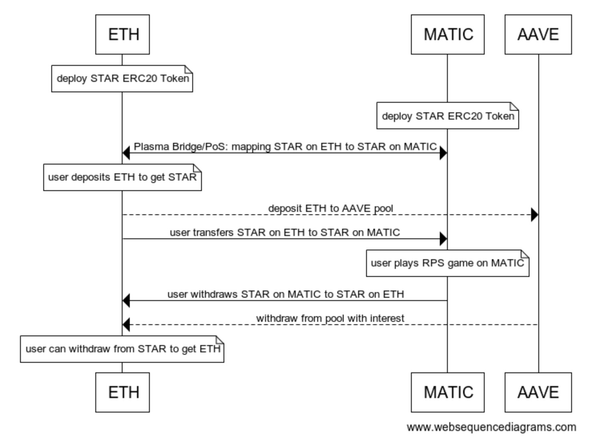
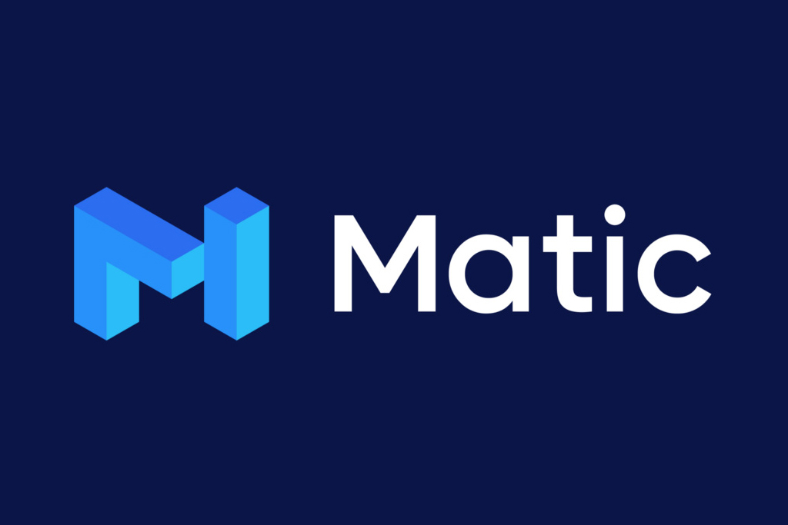

# MarketMake-Polaris
A decentralized, transparent, fair gaming platform utilizing Matic Layer 2 solutions to lower the extreme high gas fee on ETH, provide quick and affordable gaming experience. It also offer borrowing options using Aave’s Credit Delegation to allow users borrow tokens from friends to play the game and return them after winning.

# Architecture

# Technologies

